###### 	 Git笔记<br>整理汇总<br>*2026年2月3日`软哨硬吃`*


[TOC]
# 资料汇总

- 项目需要多AI协同工作，对git规范提出了要求，故将所学git整理归纳。

## 官方资料

> - Git 完整命令手册地址：http://git-scm.com/docs
>- 官方文档[Git](https://git-scm.com/book/zh/v2)
> - PDF 版命令手册：[github-git-cheat-sheet.pdf](https://www.runoob.com/manual/github-git-cheat-sheet.pdf)
>- https://www.git-tower.com/learn/git/ebook/cn/command-line/advanced-topics/git-flow)
> 


## 资源文档

> - Github漫游指南（优秀笔记）：[Home Page](https://github.phodal.com/#/)
>
> - Git备忘录：[GitHub Git 备忘单 - GitHub Cheatsheets](https://training.github.com/downloads/zh_CN/github-git-cheat-sheet/)
>
> - Monorepo：[5分钟搞懂Monorepo - 简书](https://www.jianshu.com/p/c10d0b8c5581)
>
> - git flow：https://www.jianshu.com/p/c10d0b8c5581
>
> - Learning Git Branching: https://learngitbranching.js.org/?locale=zh_CN (帮助学习 Git 分支用法)
>

>  **FastGitHub 加速原理**
>
>  `FastGitHub` 运行在本机/局域网的 GitHub 加速工具，通过ip测速、接管 DNS + 反向代理的方式，提升国内访问 GitHub 的速度，解决打不开、git clone/push 失败等问题
>
>  - 修改本机的 `DNS` 服务
>  - 解析匹配的[域名](https://cloud.tencent.com/product/domain?from_column=20065&from=20065)为 `FastGithub` 的 IP
>  - 请求安全 `DNS` 服务 (`dnscrypt-proxy`) 获取相应域名的 `IP`
>  - 选择最优的 `IP` 进行 `SSH` 或 `HTTPS` 反向代理


## 公司禁止vpn如何访问github

> 获取最新ip：https://raw.hellogithub.com/hosts
>
> 更换dns并刷新
>
> `C:\Windows\System32\drivers\etc\`

## 三个测试


> - [Git 测验 1 | 菜鸟工具](https://www.jyshare.com/quiz/7106/)
> - [Git 测验 2 | 菜鸟工具](https://www.jyshare.com/quiz/7107/)
> - [Git 测验 3 | 菜鸟工具](https://www.jyshare.com/quiz/7108/)


# Slow Start

## git配置


> **我の配置文件**
>
> 直接编辑文件比用命令更便捷，Linux在`~/.gitconfig`，win在`C:\Users\<用户名>\.gitconfig`。
>
> *==🦜==*
>
> ```.gitconfig
> [user]
> 	name = RoadS1de          # 提交时显示的用户名，和github账号无关，可以随便填
> 	email = wpp147@foxmail.com  # 提交时显示的邮箱地址
> 
> # 凭证管理配置
> [credential]
> 	helper = store  # https凭证明文存储在 ~/.git-credentials 文件中，实现HTTPS仓库免密
> 
> # HTTP/HTTPS 传输配置
> [http]
> 	sslbackend = openssl        # 使用 OpenSSL 作为 SSL 后端
> 	sslVerify = false           # 禁用 SSL 证书验证（内网无所谓，外网可能存在安全风险）
> 	postBuffer = 524288000      # POST 缓冲区大小设为 500MB，用于大文件推送
> 	lowSpeedLimit = 0           # 最低速度限制设为 0（无限制）
> 	lowSpeedTime = 999999       # 低速时间限制设为极大值，防止超时
> 	version = HTTP/1.1          # 使用 HTTP/1.1 协议版本
> 
> # diff工具
> [merge]
> 	tool = bc 
> 
> # 核心配置
> [core]
> 	editor = code --wait  # 默认编辑器：VSCode，--wait 保证 Git 等待保存并关闭文件后才继续git
> [diff]
> 	tool = bc
> 
> [alias]
> # 最佳图形化显示
> lg = log --oneline --graph --all --decorate
> 
> # 详细历史查看
> hist = log --pretty=format:\"%C(yellow)%h %C(blue)%ad %C(reset)%s %C(green)[%an]\" --date=short
> 
> # 查看最近
> recent = log --oneline -20
> 
> # 带统计的查看
> ls = log --stat -10
> 
> # 我的提交
> mylog = log --author=\"RoadS1de\" --oneline
> 
> [fetch]
> 	prune = true # 自动清理本地已不存在于远程仓库的分支引用
> 	autoMaintenance = true  # 在执行 git fetch 后自动运行后台维护任务，保持大型仓库的性能和响应速度
> [push]
> 	default = simple
> ```
>


>  **（1）Git 默认文本编辑器一般是Vim， VS Code 需要重新设置**
>  
>  *==🦜==*
>  
>  ```bash
>  git config --global core.editor "code --wait"
>  ```
>

> **（2）差异分析工具**
>
> *==🦜==*
>
> ```bash
> git config --global merge.tool vimdiff
> ```
>
> 个人更喜欢vscode，大部分人选择配置beyond compare：[beyond compare](https://www.scootersoftware.com/download.php?spm=5176.28103460.0.0.96a07551w4Eh5v)(需要配置环境变量path，确保终端能打开)
>


> **（3）查看配置是否生效**
>
> *==🦜==*
>
> ```bash
> git config --list #配置完查看
> ```
>
> 1. 重复的变量名来自不同的配置文件，Git 实际采用的是最后一个（比如 /etc/gitconfig 和 ~/.gitconfig）
> 2. git配置区分**系统级**（git的存储、缓冲区之类的设置）、**用户级**、**项目级**。

## SSH配置

> **（1）keygen**
> 
> 1. 生成一次非对称密钥，拿着私钥（身份证）到不同的电脑(公司的/个人的）都可以免密操作仓库。
> 2. 一个比喻：私钥是身份证，公钥是备案信息。想去哪里就去哪里备案——公钥放github服务器、ubuntu服务器


## 创建仓库

> 1. 官网创建再`clone`
> 
> 2. 在本地文件中`init`——`init`创建库会稍微麻烦些：main和master的区别、readme、.gitignore、LICENSE等


==不推荐init创建==


> **（1）简单的操作步骤**
> 
> *==🦜==*
> 
> ```bash
> git init    
> git add .    
> git commit  
> ```
>

## 基本操作

【金山文档 | WPS云文档】 git思维导图
https://www.kdocs.cn/l/cj2MO6WONIx7


> **（1）提交到暂存区**
> 
> *==🦜==*
> 
> ```bash
> git add .
> ```
>


> **（2）查看文件状态**
>
> 查看上次提交后是否有对文件再修改？
>
> *==🦜==*
>
> ```bash
> git status -sb
> ```


> **（3）提交备注信息**
> 
> *==🦜==*
> 
> ```bash
> git commit -m "备注消息"
> ```


> **（4）查看仓库提交历史**
> 
> *==🦜==*
> 
> ```bash
> git log
> ```


> **（5）查看 commit 命令的可用选项**
> 
> *==🦜==*
> 
> ```bash
> git commit --help
> ```


> **（6）切换分支**
> 
> *==🦜==*
> 
> ```bash
> git checkout <分支名>
> ```
> 
> - 分支不存在， 用`-b` 创建：
> 
> *==🦜==*
> 
> ```bash
> git checkout -b <分支名>
> ```


> **（7）合并分支**
>
> - ==b1==合并到当前分支
>
> *==🦜==*
>
> ```bash
> git merge b1
> ```


> **（8）删除分支**
>
> `-d`安全删除：仅当分支已合并时才删除，✅ 防误删
>
> `-D`强制删除，❌ 危险（可能丢代码）
>
> *==🦜==*
>
> ```bash
> git branch -d <分支名>
> ```


> **（9）添加远程仓库**
>
> 远程仓库 "https://abc.xyz/d/e.git" 添加为 "origin"
>
> *==🦜==*
>
> ```bash
> git remote add origin https://abc.xyz/d/e.git
> ```


> **（10）本地仓库推送到远程**
> 
> *==🦜==*
> 
> ```bash
> git push origin
> ```


> **（11）获取远程仓库修改**
>
> - 获取远程仓库" origin" 的所有修改历史记录
> - 将提交、文件和引用从远程存储库下载到本地存储库中
>
> *==🦜==*
>
> ```bash
> git fetch origin
> ```


> **（12）显示分支差异**
>
> 显示当前分支和其他分支的差异
>
> *==🦜==*
>
> ```bash
> git diff <其他分支>
> ```


# 命令汇总

---

## commit提交/修改三剑客

| 命令         | 说明                                 |
| :----------- | :----------------------------------- |
| `git status` | 查看仓库当前的状态，显示有变更的文件 |
| `git add`    | 添加文件到暂存区                     |
| `git commit` | 提交暂存区到本地仓库，`-m`附带消息   |

---

> **先用status看看总体情况**
>
> 
>
> - `git status -sb`查看总体情况。
>
> - `git status -v` 查看具体信息。

> **status选项**
>
> 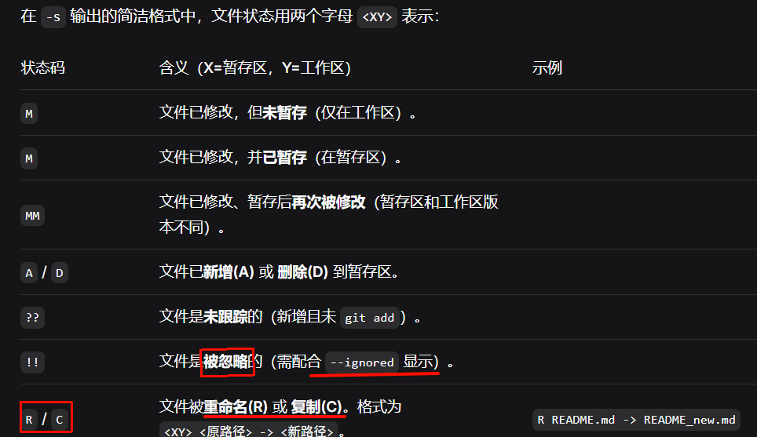


> **`checkout`后跟文件路径**
>
> 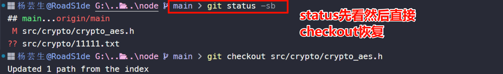
>
> 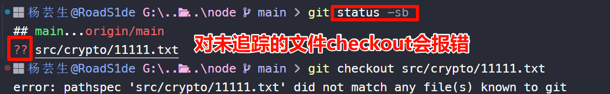

- git命令中的提交参数，可以灵活使用以下几种方式来引用提交：


|                    | 类型                     |                                                              |
| ------------------ | ------------------------ | ------------------------------------------------------------ |
| `a1b2c3d4e5f6...`  | **完整 commit hash**     | 完整 SHA-1 或 SHA-256 哈希（极少手写）                       |
| `a1b2c3d`          | **短 hash（缩写）**      | 只要 Git 能唯一识别（通常前 7 位足够）✅ **最常用**           |
| `main`、`feature`  | **分支名**               | 指向该分支最新提交（HEAD）                                   |
| `v1.2.0`           | **标签（tag）**          | 指向打标签的那个提交                                         |
| `HEAD~3`、`main^2` | **相对引用**             | 表示“当前 HEAD 往前数第 3 个”或“main 的第二个父提交”等       |
| `abc123..def456`   | **提交范围（用于多个）** | 注意：默认 **不包含起点**，实际是 `(abc123, def456]`，==范围依靠父子关系== |

## status状态与diff差异

| 命令             | 说明                                   |
| :--------------- | :------------------------------------- |
| `git diff`       | 比较文件的不同，即暂存区和工作区的差异 |
| `git difftool`   | 使用外部差异工具查看和比较文件的更改   |
| `git range-diff` | 比较两个提交范围之间的差异             |


> **（1）less交互**
>
> - `git diff` 在命令行中出现的是`less`工具，要使用`less`的快捷键
>
> | 快捷键 | 功能描述 |
> | ---------------- | ------------------ |
> | `f`/`b`         | 往后/前翻页         |
> | `/`              | 搜索               |
> | `gGq`            | 同vim              |
>


## show查看信息


**`git show` 用于查看 Git 中任意对象（提交、标签、文件、目录）的具体内容或元信息**

| 命令                                | 用途                     | 说明                                   |
| ----------------------------------- | ------------------------ | -------------------------------------- |
| `git show`                          | 查看最近一次提交（HEAD） | 默认行为，快速回顾上一次改了啥         |
| `git show <commit哈希>`             | 查看指定提交             | `<commit>` 可以是 hash、分支名、tag 等 |
| `git show <commit哈希>:<file>`      | 某次提交中某个文件       | 不带 diff，直接输出文件快照            |
| `git show --name-only <commit哈希>` | 这次提交改了哪些文件     | 快速扫描变更范围                       |
| `git show --stat <commit哈希>`      | 统计摘要（增删行数）     | 比完整 diff 更简洁                     |

---

> **--stat**
>
> 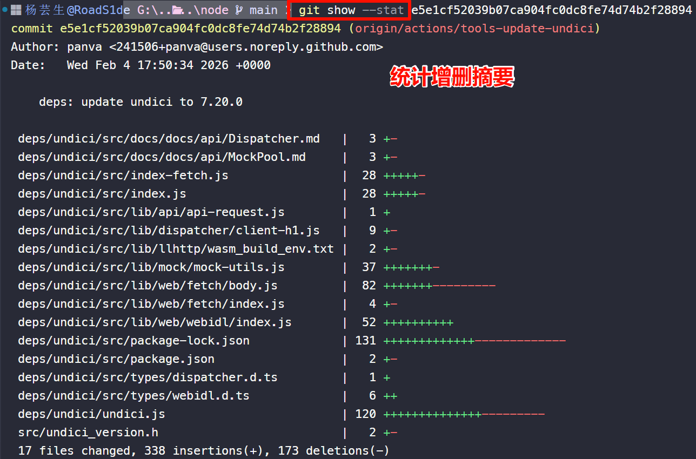

> **--name-only**
>
> 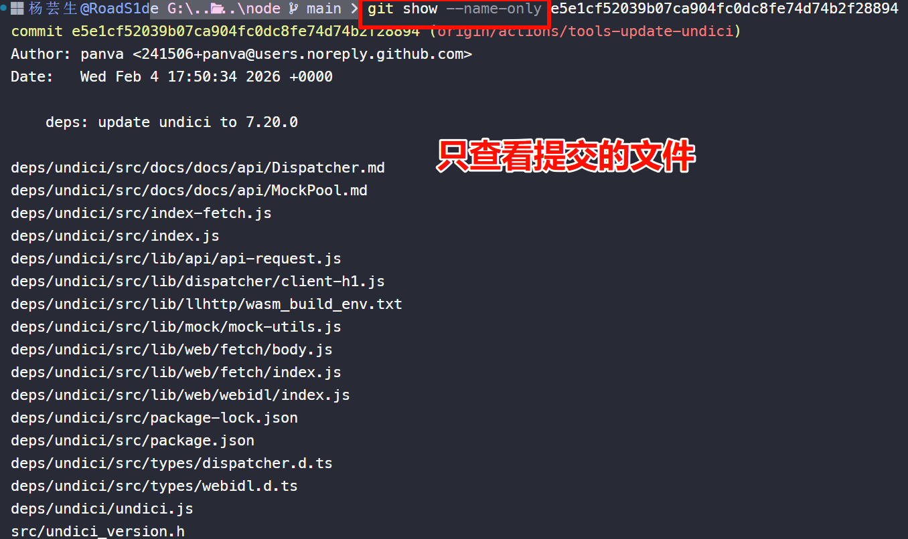


## 撤销与恢复

---


### 修改未提交


> **（1）恢复工作区**
>
> `git restore .` 只撤销工作区修改，不影响暂存区
>
> 对比：`reset --soft`还会移动`HEAD`指针，并把修改放入暂存区
>
> `restore`是2.23版本引入专门分担checkout==检出文件==功能的命令


> **（2）刚修改的想撤回**
>
> `git restore --staged`，文件从暂存区移出，恢复到HEAD状态（缺省默认）


> **（3）恢复单个文件**
>
> `git restore <文件路径>`（git版本≥2.23），传统用法：`git checkout <文件路径>`


> **（4）完全放弃工作区和暂存区**
>
> `git restore --staged --worktree .`
>
> `git reset --hard HEAD~1`


> **（5）移出未追踪文件**
>
> 


### 修改已提交


> **（1）写错注释**
>
> `git commit --amend`

> **（2）撤销错误的本地提交**
>
> `git reset --mixed HEAD~1`
>
> 如果工作区内容都不需要就使用`--hard`


> **（3）已经推到远程的错误**
>
> 不要`reset`害了同事！`revert`创建新提交来安全地撤销

### reset与revert

---

> reset：常用`git reset HEAD~1`，改写历史（错误的修改已经提交），对远程分支无效。
>
> 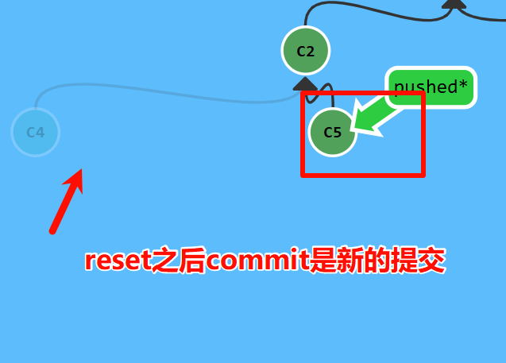

> revert：`git revert HEAD`，注意这里命令的区别。
>
> 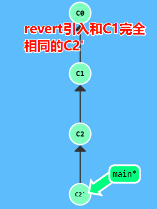

### reset选项

| 模式      | 暂存区（Index）     | 工作目录（Working Tree） | 典型用途                                                     |
| --------- | ------------------- | ------------------------ | ------------------------------------------------------------ |
| `--soft`  | ❌ 不变              | ❌ 不变                   | 合并多个提交（保留所有更改在暂存区）                         |
| `--mixed` | ✅ 重置为 `<commit>` | ❌ 不变                   | ==git默认行为==；<br />**取消所有暂存**，但工作区不变（可重新暂存） |
| `--hard`  | ✅ 重置              | ✅ 强制覆盖为 `<commit>`  | 彻底丢弃所有更改（⚠️ 危险！会丢失未提交的修改）               |

> **如何理解`--mixed`？**
>
> - 提交情况回到上次`commit`的时候，但工作区文件仍然保留，获得重新组织`commit`提交的机会。

### 文件操作/其他

| 命令        | 说明                         |
| :---------- | :--------------------------- |
| `git rm`    | 将文件从暂存区和工作区中删除 |
| `git mv`    | 移动或重命名工作区文件       |
| `git notes` | 添加注释                     |


| **命令**                        | **说明**                 |
| :------------------------------ | :----------------------- |
| `git merge <分支名>`            | 将指定分支合并到当前分支 |
| `git mergetool`                 | 使用默认合并工具解决冲突 |
| `git mergetool --tool=<工具名>` | 指定合并工具解决冲突     |


`merge`必须确定方向！错误在`bugFix分支`执行`merge`的后果：不会丢代码，但逻辑错误

`bugFix` 分支包含了 `main` 最新内容
`main` 分支**仍然没有 bug 修复**，导致修复未上线

- Fast-merge：当前节点是merge节点的祖先时，不会创建新节点，可以用`--no-ff`强制新提交

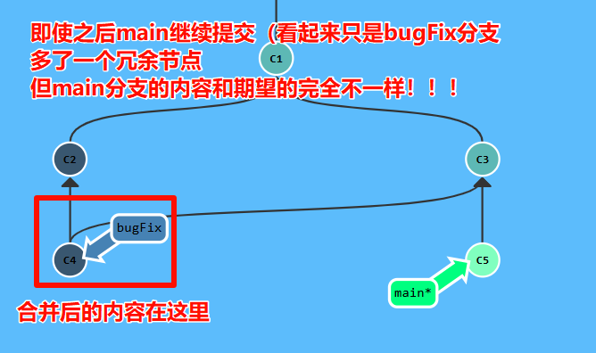

### rebase

和merge的用法不同❌对需要变基的分支直接调用`git rebase -i main`就行了。


| 冲突处理选项 | 说明                         |
| ------------ | ---------------------------- |
| `--continue` | 解决冲突后，继续变基流程。   |
| `--abort`    | 终止变基，回到操作前的状态。 |
| `--skip`     | 跳过当前引发冲突的提交。     |

第二种合并分支的方法是 `git rebase`。Rebase 实际上就是取出一系列的提交记录（cherry-pick？），“复制”它们，然后在另外一个地方逐个的放下去。

Rebase 的优势就是可以创造更线性的提交历史，这听上去有些难以理解。如果只允许使用 Rebase 的话，代码库的提交历史将会变得异常清晰。

Fast merge

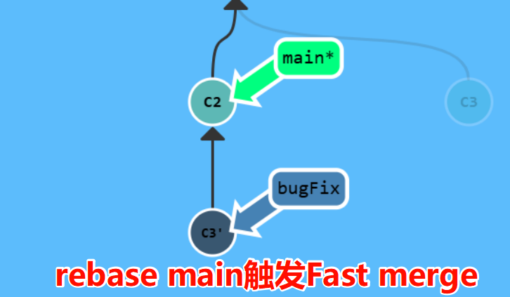


### cherry-pick

- `git cherry-pick <提交>...`pick多个提交到当前分支（比如main），然后main分支跟着提交移动。执行前要求工作目录无未提交修改
- 实际上可以视为选择性合并，而且很简单

---

> | 选项                | 用途与说明                                                   |
> | ------------------- | ------------------------------------------------------------ |
> | `-n`, `--no-commit` | **只应用变更到工作区和暂存区，但不创建新提交**。适用于想将多个提交的变更合并后一次性提交。 |
> | `-e`, `--edit`      | 提交前允许编辑提交信息                                       |

> | 冲突处理选项 | 说明                         |
> | ------------ | ---------------------------- |
> | `--continue` | 解决冲突后，继续变基流程。   |
> | `--abort`    | 终止变基，回到操作前的状态。 |
> | `--skip`     | 跳过当前引发冲突的提交。     |

## tag打标签

==**给“快照”起一个有意义的名字**==

> - 每次发布新版本（如 v1.0.0、v2.3.1），就打一个标签，运维同事只需知道：“部署 v1.0.1”，而不需要记住一长串 commit hash。同时发布版本的标签命名可以用`v1.0.0-Release`来标记发布版。
>
> - 未来**可以快速回到这个稳定版本**，比如：
>
>   - 用户报告 v1.2.0 有 bug，你可以立刻 `git checkout v1.2.0` 查看当时的代码。
>   - 部署系统可以直接拉取 `v2.1.5` 构建生产环境。
>
>   `git tag -n`查看带注释的标签
>
>   `git tag -a <标签名> -m <注释>`打带注释的标签


## 远程操作

| 命令            | 说明                        |
| :-------------- | :-------------------------- |
| `git remote`    | 远程仓库操作                |
| `git fetch`     | 从远程获取代码库            |
| `git pull`      | 下载远程代码并合并          |
| `git push`      | 上传远程代码并合并          |
| `git submodule` | 管理包含其他 Git 仓库的项目 |

### clone

==常用浅克隆==

`git clone --depth 1 <仓库地址>`只下载最近一次提交，节省空间和时间


### 远程分支


- `origin/main` **远程**分支特殊属性：切换到远程分支时，自动进入`分离 HEAD` 状态。Git 不希望开发者能直接操作远程分支。正确方法是在本地完成工作, 更新远程分支后，再用远程命令分享工作成果。

### 远程跟踪分支

- pull与push时，Git 如何知道 `main` 对应`origin/main` ；是因为名字相似而关联吗？
  - 答案是：由分支的==remote tracking==属性决定，`main` 跟踪 `origin/main` 指定了==推的目的地==及==拉的合并目标==。
  - 克隆时, Git 自动设置：1.将远程所有分支映射为本地跟踪分支（如 `origin/main`）；其次，检出并创建一个与远程默认分支同名的本地分支（如 `main`），并将其设置为跟踪该远程分支，便于直接开始工作。
  

> **略**
>
> - pull 时, 提交记录先下载到 `origin/main` 上，再合并到本地的 `main` 分支。的。
>
> - push 时, 工作从 `main` 推到远程仓库中的 `main` 分支(同时更新远程分支 `origin/main`) 。
>
>   
>


### 上游


关键概念：上游分支 (Upstream Branches)：本质就是一个远程跟踪分支，可以通过`push -u`指定，`clone`的仓库也会自动建立跟踪关系。能够让push和pull不带参数工作。

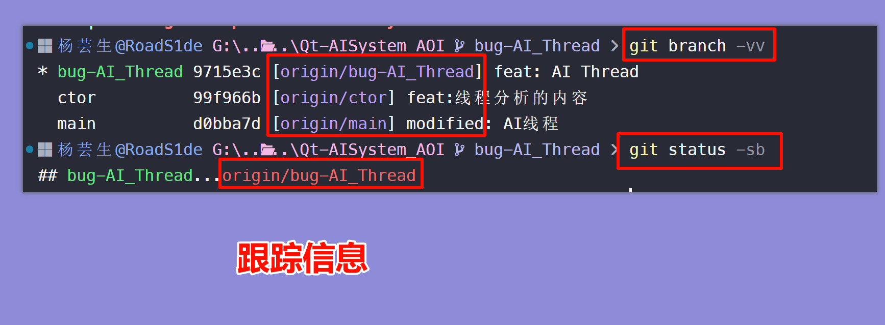

### Git Fetch

==**永远不会弄乱你的代码，只负责把新东西给你看**==

-  远程仓库默认为 `origin`，反应了==上次和它通信时的状态==。
-  `git fetch` 拉当前分支的 upstream（如果配置了），否则拉 `origin`

> **`git fetch` 做的事**
>
> - 从远程仓库下载本地仓库中缺失的提交记录
>
> - 更新远程分支指针（如 `origin/main`）
>
>   总结：`git fetch` 实际更新==**本地仓库中的远程分支**==为远程的最新状态，实际上不会改变本地仓库状态、更新 `main` 分支、修改磁盘上文件。（这是pull才会做的事）
>

> **进阶用法**
>
> -  指定远程仓库名`git fetch origin -j4`
> -  只拉取远程 main 分支的更新 `git fetch origin main`
> -   `-p`/`--prune`：清理“远程已删”的跟踪分支
> -  `git diff main origin/main` 查看差异
> -  `git fetch --dry-run` 模拟一次 `fetch` 操作，告诉你哪些引用会被更新

### pull 

==`pull`是`fetch` 与 `merge`的组合==

`fetch`可以获取远程的数据,但是如何将这些变化更新到本地的工作呢？

答案是==像合并本地分支那样来合并远程分支==，这意味着可以执行以下命令


1. `git cherry-pick origin/main`
2. `git rebase origin/main`
3. `git merge origin/main`
4. 等等……

实际由于==抓取更新+合并到本地分支==流程很常用，git提供了专门的命令`git pull`。


### push

*==🦜==*

```
git push <remote> <place>
```


`<place>`可以是`<本地分支>:<远程分支>`，省略 `:<远程分支>` 时，==默认本地、远程同名==。

推的分支在远程不存在会直接创建。

同时因为指定了src/des，HEAD分离也不会影响该命令准确性。

`git push origin main`切到本地仓库`main`分支获取所有提交，再到远程仓库`origin`中找到`main`分支，添加它没有的提交记录。

> 正确设置上游分支：远程仓库名/分支名
>
> - **`-u` 即 `--set-upstream`**：✅✅✅重要参数`git push -u origin` 分支名，将本地分支与远程分支“绑定”（设置上游分支）后，只需 `git push` 和 `git pull` 即可，无需再指定仓库和分支名。
>
> - 推送当前分支到远程同名分支（推荐）：`git push -u origin feature/abc`
> - 推送指定本地分支到远程指定分支：`git push origin feature/abc:feature/abc`
> - 推送当前分支到远程不同名字：`git push origin feature/abc:feature/xyz`


| push的default值         | 行为                                                         | 是否推荐                    |
| ----------------------- | ------------------------------------------------------------ | --------------------------- |
| `simple`                | 只推送当前分支到同名远程分支，且必须已建立上游关联（即用过 `-u`）。<br />安全、明确、无歧义。 | ✅ 强烈推荐（现代 Git 默认） |
| `upstream` / `tracking` | 推送到当前分支的上游分支（即使名字不同）。                   | ⚠️ 少用                      |
| `current`               | 推送当前分支到远程同名分支（即使没设上游）。                 | ⚠️ 可能意外创建远程分支      |
| `matching`              | （旧默认）推送所有本地和远程都存在的同名分支。极其危险！     | ❌ 禁止使用                  |


个人/团队保持 `push.default = simple`，养成用 `-u` 或显式写 `origin 分支名` 的习惯，可避免误操作


> **功能合并后清理无用分支**
>
> *==🦜==*
>
> ```
> # 安全、清晰的删除方式（推荐）
> git push origin --delete <branch-name>
> 
> # 示例
> git push origin --delete feature/old-feature
> ```
>


## 分支

---

### branch

- `git branch`只操作“分支引用”，不涉及工作区切换、内容合并等。
- 比如只是想打个标记（比如备份当前的进度），但不打算马上过去开发，`git branch`就是一个非常安全的命令

| **命令**                          | **说明**                   |
| :-------------------------------- | :------------------------- |
| `git branch`                      | 列出所有==本地==分支       |
| `git branch -a`                   | 列出本地 + 远程分支        |
| `git switch -c <新分支>` | 创建并切换到新分支（新版本命令） |
| `git branch <新分支>`             | 基于HEAD创建新分支（不切换！） |
| `git branch <分支名> <起点>` | 基于指定==提交或分支==创建新分支。 |
| `git branch -d <旧分支>`          | 删除分支                   |
| `git branch -m <旧分支名> <新分支名>` | 重命名分支                 |
| `git branch --show-current` | 仅打印当前分支名 |
| `git branch --list 'feat-*'` | 通配符过滤:只列出以 `feat-` 开头的分支 |

#### 具体场景

| 使用场景                                                | 对应命令                             |
| :------------------------------------------------------ | :----------------------------------- |
| 基于当前工作创建一个新功能分支                          | `git branch feature-xxx`             |
| 创建一个分支，起点是远程的 `main`                       | `git branch feature-xxx origin/main` |
| 查看合并到当前分支的分支，准备清理                      | `git branch --merged`                |
| 刚刚修复了一个 Bug，想基于提交 `a1b2c3d` 创建热修复分支 | `git branch hotfix a1b2c3d`          |
| 误操作了——想强制删除一个未合并分支                      | `git branch -D bad-branch`           |
| 当前分支和远程分支的对应关系                            | `git branch -vv`                     |
| 当前分支 `dev` 的上游设置为 `origin/develop`            | `git branch -u origin/develop`       |

### checkout

> **`checkout`来鹅城只办三件事**
>
> 1. 切换分支
> 2. 恢复文件
> 3. 检出特定提交

| **命令**                    | **说明**         |
| :-------------------------- | :--------------- |
| `git checkout <分支名>`     | 切换到指定分支   |
| `git checkout <文件名>`     | 恢复文件到工作区 |
| `git checkout <commit哈希>` | 检出特定提交     |

- `git checkout <commit哈希>`切换到特定提交（HEAD发生分离），工作目录内容变为==该提交时的状态==，不建议直接在此基础上直接修改，先创建一个分支！

  

> **不要在HEAD分离状态下提交！**
>
> - **分离 HEAD（detached HEAD）** 时提交，Git **会正常创建新的提交对象**，但==**不会被任何分支引用**==。意味着：
>   
>   1. 提交本身真实存在，但由于没有分支指向它，一旦切换到其他分支，将无法通过常规方式访问它
>   
>   2. 补救措施：及时通过**分支**或**标签**“锚定”，避免未来被 Git 的垃圾回收机制（garbage collection）清除。
>   
>   
>


### 分支合并

git merge合并其他分支到当前分支，如 `feature`合并到`main`，所以应该记住，在分支上写完之后需要合并到main得先切换到main去。


为了 `push` 新变更到远程仓库，首先要**包含**远程仓库中最新变更（只要本地分支包含远程分支，如 `origin/main`中最新变更，可以选择`rebase` 或 `merge`。

那么有分支的push？


> **merge还是rebase**
>
> 开发社区里，有许多关于 merge 与 rebase 的讨论：
>
> rebase优点:提交树很干净,所有提交都在一条线上
>
> 缺点:修改了提交树历史
>
> 比如, 提交 C1 可以被 rebase 到 C3 之后。这看起来 C1 中的工作是在 C3 之后进行的，但实际上是在 C3 之前。
>
> 一些开发人员喜欢保留提交历史，更偏爱 merge；有的可能更喜欢干净的提交树，于是偏爱 rebase。 

### 临时保存更改

---
| **命令**           | **说明**                   |
| :----------------- | :------------------------- |
| `git stash`        | 保存当前未提交的更改       |
| `git stash pop`    | 恢复最近保存的更改         |
| `git stash list`   | 列出所有保存的更改         |

### 其他辅助命令

>| **命令**                                  | **说明**                           |
>| :---------------------------------------- | :--------------------------------- |
>| `git log`                                 | 显示提交历史                       |
>| `git log --oneline`                       | 以简洁模式显示提交历史             |
>| `git tag`                                 | 列出所有标签                       |
>| `git tag <标签名>`                        | 创建新标签                         |
>| `git tag -d <标签名>`                     | 删除标签                           |
>| `git worktree add <路径> <分支名>`        | 在指定路径添加新工作区并切换分支   |
>| `git worktree remove <路径>`              | 删除工作区                         |


## 文件状态
---

配合工作区、暂存区、本地仓库、远程仓库理解。

**（1）未跟踪（Untracked）**

 > 新建文件，Git 尚未跟踪

*==🦜==*

```bash
touch file.txt
```

**（2）已跟踪（Tracked）**

`git add` 后，文件加入**版本控制**（暂存区）

*==🦜==*

```bash
git add file.txt
```

**（3）已修改（Modified）**

==已跟踪文件==被修改，但还未暂存

*==🦜==*

```bash
echo "update" > file.txt
```

**（4）已暂存（Staged）**

`git add` 放入暂存区，准备提交

*==🦜==*

```bash
git add file.txt
```

**（5）已提交（Committed）**

>`git commit` 暂存内容保存到本地仓库
>
>*==🦜==*
>
>```bash
>git commit -m "message"
>```

 

# 日常使用

---

 

## **Scenario 1**

==模拟初入公司的git使用==

**（1）克隆仓库**

参与一个已有项目，首先克隆远程仓库到本地

*==🦜==*

```bash
git clone https://github.com/username/repo.git #或ssh仓库
```

**（2）创建新分支**

通常创建一个新分支，避免直接在 master 分支开发

*==🦜==*

```bash
git checkout -b new-feature
```

**（3）暂存文件**

修改过的文件添加到暂存区

*==🦜==*

```bash
git add <文件名>
# 添加工作区所有修改的文件
git add .
```

**（4）提交更改**

提交到本地仓库，并备注

*==🦜==*

```bash
git commit -m "我是无情的备注信息"
```

**（5）拉取最新更改**

在推送本地更改之前，最好从远程仓库拉取最新的更改，以避免冲突

*==🦜==*

```bash
git pull origin main
# 或者如果在新的分支上工作
git pull origin new-feature
```

**（6）推送更改**

将本地的提交推送到远程仓库

*==🦜==*

```bash
git push origin new-feature
```

**（7）创建 Pull Request**

在 GitHub/其他平台上创建 `Pull Request`/`Merge Request`（GitLab 可能的叫法），邀请团队成员代码审查。PR 后更改合并到主分支

**（8）合并更改**

远程仓库主分支合并到本地分支

*==🦜==*

```bash
git checkout main
git pull origin main
git merge new-feature
```

**（9）删除分支**

删除本地不再需要的功能分支

*==🦜==*

```bash
git branch -d new-feature
```

或从远程仓库删除分支：

*==🦜==*

```bash
git push origin --delete new-feature
```

 

## Scenario 2

==解决代码冲突==

**（1）冲突产生原因**

两个分支修改了同一文件的同一部分或同一文件名，在合并时 Git 无法自动决定保留哪个版本

**（2）合并前先获取**

在合并前先获取远程最新代码，查看差异

*==🦜==*

```bash
# 获取远程仓库的最新信息（不会自动合并）
git fetch origin

# 查看本地分支和远程分支的差异
git diff origin/main

# 查看远程分支列表
git branch -r
```

**（3）发现冲突**

尝试合并或拉取时，Git 会提示冲突

*==🦜==*

```bash
git pull origin main
# 或
git merge feature-branch

# 输出类似：
# Auto-merging file.txt
# CONFLICT (content): Merge conflict in file.txt
# Automatic merge failed; fix conflicts and then commit the result.
```

**（4）查看冲突文件**

使用 status 查看哪些文件存在冲突

*==🦜==*

```bash
git status -sb

# 输出会显示：
# Unmerged paths:
#   both modified:   file.txt
```

**（5）解决冲突步骤**

**a. 沟通优先**：与另一位开发者沟通，商定代码取舍方案

**b. 打开冲突文件**：Git 会在文件中标记冲突区域

```
<<<<<<< HEAD
你的代码
======= 
别人的代码
> feature-branch
```

**c. 手动编辑**：删除冲突标记，保留需要的代码

**d. 标记为已解决**：将修改后的文件添加到暂存区

**e. 完成合并**：提交解决冲突后的代码

*==🦜==*

```bash
git commit -m "解决与 feature-branch 的合并冲突"
git push origin main
```

**（6）放弃合并**

取消本次合并，恢复到合并前状态

*==🦜==*

```bash
git merge --abort
# 或取消 pull 操作
git reset --hard HEAD
```


**（8）预防冲突的最佳实践**

- 频繁拉取远程代码：`git pull origin main` 保持同步
- 小步提交：避免一次性修改大量文件
- 及时推送：不要长时间不推送本地代码
- 分工明确：团队成员尽量避免同时修改同一文件
- 使用 rebase：`git pull --rebase` 保持整洁的提交历史


# .gitignore 文件写法


> **(1) 通配符**
> 
> `#`是注释，会被git忽略，空行无实际意义
> - `test.txt`  忽略根目录下的 `test.txt`。
> - `src/test.txt` 忽略 `src` 目录下的 `test.txt`
> - `*`：匹配任意个字符（0个或多个），但不包含目录分隔符 `/`。
> - `?`：匹配任意单个字符。
> - `**`：匹配==任意层级==的目录。
> - `**/build` -> 忽略任何位置下的 `build` 目录或文件（如 `src/build`, `build`, `a/b/c/build`）。
>
> 
>
> 


> **(2) 例：Cmake项目管理**
> 
> cmake通常屏蔽build目录下所有内容、生成的临时文件等
> 
> *==🦜==*
>
> ```.gitignore
> # CMake 生成文件
> CMakeCache.txt
> CMakeFiles/
> cmake_install.cmake
> Makefile
> *.cmake
> !CMakeLists.txt  # 确保不忽略CMakeLists.txt本身
> 
> 
> # 屏蔽任何层级下的 build 目录（推荐，更全面）
> **/build/
> 
> # 屏蔽常见的 IDE 构建目录（如 CLion 自动生成的）
> cmake-build-*/
> 
> 
> # 编译器生成的临时文件
> *.o
> *.a
> *.so
> *.dylib
> *.exe
> *.out
> ```


##    实例

远程分支

偏离的提交历史

locked main

开始前我们先创建一个测试目录：

```
$ mkdir gitdemo
$ cd gitdemo/
$ git init
Initialized empty Git repository...
$ touch README
$ git add README
$ git commit -m '第一次版本提交'
[master (root-commit) 3b58100] 第一次版本提交
 1 file changed, 0 insertions(+), 0 deletions(-)
 create mode 100644 README
```


## Git 分支管理

### 列出分支

列出分支：

```
git branch
```

没有参数时，**git branch** 会列出你在本地的分支。

```
$ git branch
* master
```

此例的意思就是，我们有一个叫做 **master** 的分支，并且该分支是当前分支。

当你执行 **git init** 的时候，默认情况下 Git 就会为你创建 **master** 分支。

如果我们要手动创建一个分支。执行 **git branch (branchname)** 即可。

```
$ git branch testing
$ git branch
* master
  testing
```

现在我们可以看到，有了一个新分支 **testing**。

当你以此方式在上次提交更新之后创建了新分支，如果后来又有更新提交， 然后又切换到了 **testing** 分支，Git 将还原你的工作目录到你创建分支时候的样子。

接下来我们将演示如何切换分支，我们用 git checkout (branch) 切换到我们要修改的分支。

```
$ ls
README
$ echo 'runoob.com' > test.txt
$ git add .
$ git commit -m 'add test.txt'
[master 3e92c19] add test.txt
 1 file changed, 1 insertion(+)
 create mode 100644 test.txt
$ ls
README        test.txt
$ git checkout testing
Switched to branch 'testing'
$ ls
README
```

当我们切换到 **testing** 分支的时候，我们添加的新文件 test.txt 被移除了。切换回 **master** 分支的时候，它们又重新出现了。

```
$ git checkout master
Switched to branch 'master'
$ ls
README        test.txt
```

我们也可以使用 git checkout -b (branchname) 命令来创建新分支并立即切换到该分支下，从而在该分支中操作。

```
$ git checkout -b newtest
Switched to a new branch 'newtest'
$ git rm test.txt 
rm 'test.txt'
$ ls
README
$ touch runoob.php
$ git add .
$ git commit -am 'removed test.txt、add runoob.php'
[newtest c1501a2] removed test.txt、add runoob.php
 2 files changed, 1 deletion(-)
 create mode 100644 runoob.php
 delete mode 100644 test.txt
$ ls
README        runoob.php
$ git checkout master
Switched to branch 'master'
$ ls
README        test.txt
```

如你所见，我们创建了一个分支，在该分支上移除了一些文件 test.txt，并添加了 runoob.php 文件，然后切换回我们的主分支，删除的 test.txt 文件又回来了，且新增加的 runoob.php 不存在主分支中。

使用分支将工作切分开来，从而让我们能够在不同开发环境中做事，并来回切换。

### 删除分支

删除分支命令：

```
git branch -d (branchname)
```

例如我们要删除 testing 分支：

```
$ git branch
* master
  testing
$ git branch -d testing
Deleted branch testing (was 85fc7e7).
$ git branch
* master
```

### 分支合并

一旦某分支有了独立内容，你终究会希望将它合并回到你的主分支。 你可以使用以下命令将任何分支合并到当前分支中去：

```
git merge
$ git branch
* master
  newtest
$ ls
README        test.txt
$ git merge newtest
Updating 3e92c19..c1501a2
Fast-forward
 runoob.php | 0
 test.txt   | 1 -
 2 files changed, 1 deletion(-)
 create mode 100644 runoob.php
 delete mode 100644 test.txt
$ ls
README        runoob.php
```

以上实例中我们将 newtest 分支合并到主分支去，test.txt 文件被删除。

合并完后就可以删除分支:

```
$ git branch -d newtest
Deleted branch newtest (was c1501a2).
```

删除后， 就只剩下 master 分支了：

```
$ git branch
* master
```

### 合并冲突

合并并不仅仅是简单的文件添加、移除的操作，Git 也会合并修改。

```
$ git branch
* master
$ cat runoob.php
```

**注意：**如果没有 runoob.php，需要先创建这个文件，命令可以是 **touch runoob.php**。

首先，我们创建一个叫做 change_site 的分支，切换过去，我们将 runoob.php 内容改为:

```
<?php
echo 'runoob';
?>
```

创建 change_site 分支：

```
$ git checkout -b change_site
Switched to a new branch 'change_site'
$ vim runoob.php
$ head -3 runoob.php
<?php
echo 'runoob';
?>
$ git commit -am 'changed the runoob.php'
[change_site 7774248] changed the runoob.php
 1 file changed, 3 insertions(+)

```

vim 命令操作可以参阅：[Linux vi/vim](https://www.runoob.com/linux/linux-vim.html)。

将修改的内容提交到 change_site 分支中。 现在，假如切换回 master 分支我们可以看内容恢复到我们修改前的(空文件，没有代码)，我们再次修改 runoob.php 文件。

```
$ git checkout master
Switched to branch 'master'
$ cat runoob.php
$ vim runoob.php    # 修改内容如下
$ cat runoob.php
<?php
echo 1;
?>
$ git diff
diff --git a/runoob.php b/runoob.php
index e69de29..ac60739 100644
--- a/runoob.php
+++ b/runoob.php
@@ -0,0 +1,3 @@
+<?php
+echo 1;
+?>
$ git commit -am '修改代码'
[master c68142b] 修改代码
 1 file changed, 3 insertions(+)
```

现在这些改变已经记录到我的 "master" 分支了。接下来我们将 "change_site" 分支合并过来。

```
$ git merge change_site
Auto-merging runoob.php
CONFLICT (content): Merge conflict in runoob.php
Automatic merge failed; fix conflicts and then commit the result.

$ cat runoob.php     # 打开文件，看到冲突内容
<?php
<<<<<<< HEAD
echo 1;
=======
echo 'runoob';
> change_site
?>
```

我们将前一个分支合并到 master 分支，一个合并冲突就出现了，接下来我们需要手动去修改它。

```
$ vim runoob.php 
$ cat runoob.php
<?php
echo 1;
echo 'runoob';
?>
$ git diff
diff --cc runoob.php
index ac60739,b63d7d7..0000000
--- a/runoob.php
+++ b/runoob.php
@@@ -1,3 -1,3 +1,4 @@@
  <?php
 +echo 1;
+ echo 'runoob';
  ?>
```

在 Git 中，我们可以用 git add 要告诉 Git 文件冲突已经解决

```
$ git status -s
UU runoob.php
$ git add runoob.php
$ git status -s
M  runoob.php
$ git commit
[master 88afe0e] Merge branch 'change_site'
```

现在我们成功解决了合并中的冲突，并提交了结果。

# 查看提交历史&标签


# 钩子hook

1

# CLI

### Wildcard注意事项

- Shell 会自动展开未转义的通配符：

- `git restore *.c` → Shell 展开为具体文件列表。
- `git restore \*.c` 或 `git restore '*.c'` → Git 自己匹配索引中的路径。
- 两者行为不同，尤其在文件已被删除但仍在索引中时。

### 基本参数顺序

  - **选项（options）在前，参数（arguments）在后**
    例如：`git commit -m "msg" file.txt`
  - **修订版本（revisions）在前，路径（paths）在后**
    例如：`git diff v1.0 v2.0 src/`

避免歧义：使用 -- 分隔符
当参数可能被误认为是修订或路径时，用 -- 明确分隔：
git diff -- HEAD → 比较工作区中名为 HEAD 的文件
git diff HEAD -- → 比较 HEAD 提交与整个工作区
在脚本中处理用户输入时，强烈建议显式使用 -- 避免歧义。
⚠️ 注意：-- 不能用于分隔选项和修订（此时应使用 --end-of-options）。
. 魔法文件名选项
支持 : 前缀表示“可选文件”
bash

编辑

git commit -F :COMMIT_EDITMSG

# 公司提交规范


---

==提交原则==

1. ==单一职责==：每次提交只能包含同一类别，不混合不同类型
2. ==小而清晰==：每次提交不能超过 3 个问题，确保改动明确
3. ==信息规范==：提交信息必须使用指定前缀和简洁描述

---

## 🔄 前缀分类与作用

### 🚀 功能相关

> **`feat`** - 新增功能或页面
> 
> 示例：`feat: 增加用户登录功能`

> **`fix`** - 修复 Bug 或问题
> 
> 示例：`fix: 修复登录页面的登录失败Bug`

> **`modify`** - 修改已有功能
> 
> 示例：`modify: 修改订单页面的支付功能`

> **`delete`** - 删除功能或文件
> 
> 示例：`delete: 删除旧版支付页面`

### ⚡ 优化/重构相关

> **`perf`** - 优化代码或性能改进
> 
> 示例：`perf: 提升查询性能`

> **`refactor`** - 重构代码，不涉及功能新增或 Bug 修复
> 
> 示例：`refactor: 重构用户管理模块`

### 🎨 样式和文档相关

> **`style`** - 代码风格变动，和功能无关
> 
> 示例：`style: 规范化代码缩进和格式`

> **`docs`** - 文档修改或注释变更
> 
> 示例：`docs: 更新API使用文档`

### 🔧 构建和工具相关

> **`build`** - 构建工具或依赖相关的更改
> 
> 示例：`build: 添加webpack配置`

> **`chore`** - 非 src/test 的项目配置修改
> 
> 示例：`chore: 更新依赖库`

> **`ci`** - 持续集成配置相关的修改
> 
> 示例：`ci: 修改GitHub Actions的构建流程`

### 🧪 测试和自动化

> **`test`** - 新增或修改测试用例
> 
> 示例：`test: 添加用户模块的单元测试`

> **`workflow`** - 工作流改进
> 
> 示例：`workflow: 优化CI工作流`

### 📁 其他

> **`revert`** - 撤销某次提交
> 
> 示例：`revert: 回滚上次对登录功能的修改`

> **`types`** - 修改类型定义文件
> 
> 示例：`types: 更新TypeScript类型定义`

> **`wip`** - 开发中，未完成的提交
> 
> 示例：`wip: 初始化用户管理功能`


# git在AI中使用


# 常见面试题
## 理论


> **（1）简述 Git 的原理和工作流程**
>
> Git 是一个分布式版本控制系统，存储每次提交的**快照**而非只存储有差异的地方
>
> **Git 的分布式是它和其他版本控制系统的核心区别**：如 SVN、CVS 等
>
> 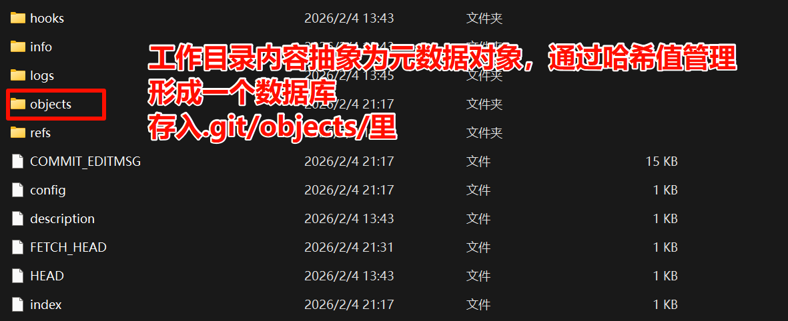

> **（2）什么是版本控制系统/为什么需要版本控制系统？**
> 
> 跟踪项目变化，回溯、协作开发、管理不同版本

> **（3）git fetch 和 git pull 命令的区别？**
> 
> **`git fetch`**：从远程仓库获取最新数据，但不自动合并到本地分支，仅更新远程分支信息
> 
> **`git pull`**：相当于 `git fetch` + `git merge`，会拉取并自动合并远程分支到当前分支

> **（4）git rebase 和 git merge 命令的区别？**
> 
> **`git merge`**：将两个分支的历史合并为一个，保留完整的历史记录，形成"分叉"结构
> 
> **`git rebase`**：将当前分支的提交"重放"到目标分支上，使历史线性化，看起来像是连续提交，但会修改提交历史

> **（5）什么是 Git Flow，它有什么好处？**
> 
> 标准化分支管理策略与扩展命令，分支包含主干（main/master）、开发（develop）、功能（feature）、发布（release）和热修复（hotfix），适合大型项目迭代，但小型项目一天多次发布反而冗余

> **（6）什么是暂存区？Git 为什么需要暂存区？**
> 
> 可以通过暂存区精细控制提交内容，实现部分提交

---

## 实践

> **（1）分享下你团队中使用 Git 协作开发流程（从拉取项目到上线）**
> 
> 典型流程：克隆仓库 → 创建功能分支 → 开发并提交 → 推送分支 → 提交 PR（Pull Request） → 审查代码 → 合并到 develop 或 main → 构建部署 → 上线

> **（2）如何控制某些文件不被提交？**
> 
> 使用 `.gitignore` 文件列出不需要版本控制的文件/目录（如日志、临时文件、配置文件等）

> **（3）什么情况下提交会冲突，如何解决冲突？**
> 
> **冲突情况**：修改了同一文件的相同行时
> 
> **解决方式**：最快就是交流选择保留的内容

> **（4）改错了代码、删除了文件，如何恢复？**
> 
> **改错代码**：使用 `git checkout HEAD -- <file>` 恢复文件到最近提交状态
> 
> **删除文件**：使用 `git restore <file>` 或 `git checkout HEAD -- <file>` 恢复。若已提交，可使用 `git reset` 或 `git revert` 回滚

> **（5）提交错文件，如何处理？**
> 
> **尚未推送**：使用 `git reset HEAD~1` 撤销最近一次提交
> 
> **已经推送**：使用 `git revert` 创建一个新的反向提交，或 `git reset --hard`（谨慎使用）

> **（6）团队开发中，如何区分和管理分支？**
> 
> 采用规范命名（如 `feature/login`、`bugfix/timeout`），结合 Git Flow 或 GitHub Flow。使用分支保护规则、PR 审查机制，确保代码质量

> **（7）你负责团队如何管理项目代码？**
> 
> 制定统一的开发规范、分支策略、代码审查流程；引入 CI/CD 自动化测试；定期进行代码重构与技术评审；使用权限管理控制访问

> **（8）如何防止错误代码提交？**
> 
> - 使用 `.gitignore` 防止误提交
> - 设置预提交钩子（pre-commit hook）运行检查
> - 强制代码审查（Code Review）
> - 启用 CI 流程自动检测错误
> - 建立规范的提交信息格式
> - 强制代码审查（Code Review）
> - 启用 CI 流程自动检测错误
> - 建立规范的提交信息格式


# The End
